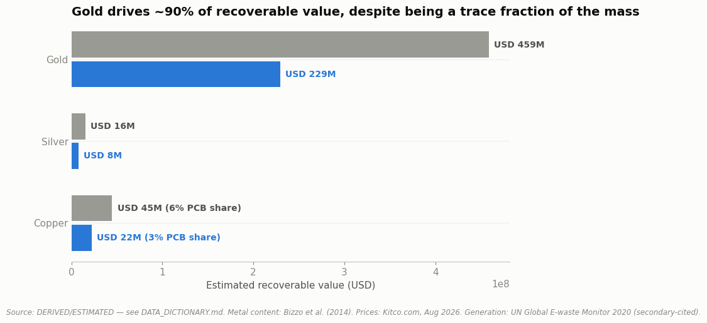

# Malaysia's E-Waste Opportunity: Recoverable Value vs. Formal Capture (2019–2021 Data, 2026 Pricing)



**Part of a [6-case-study portfolio](https://github.com/ooi-darren)**. See the other five.

## The Question

How much economic value in recoverable metals (copper, gold, silver) sits inside Malaysia's e-waste stream, how much of it is the formal, government-tracked recycling system actually capturing, and does that gap represent a real business opportunity, or something else?

## Status

✅ **Analysis complete.** Two notebooks, the first sizes the recoverable-value opportunity, the second measures the formal-capture gap and argues directly against reading it as free money on the table.

## Key Findings

**1. Malaysia's e-waste stream likely holds USD 260–520 million in recoverable copper, gold, and silver, with gold driving ~90% of that value.** Based on Malaysia's estimated 2019 e-waste generation (364,000 tonnes), published research on printed-circuit-board metal content, and current (August 2026) metal prices. The range is wide because the underlying assumptions are, not because the analysis is imprecise for its own sake; this is the most estimate-heavy case study in this portfolio, and that is stated plainly rather than hidden behind false-precision numbers. *([Notebook 01](./notebooks/01-recoverable-value-sizing.ipynb))*

**2. Formal collection captures well under 1% of that stream by weight, but that gap is not simply an open business opportunity.** Malaysia's Department of Environment collected 2,459 tonnes of household e-waste in 2021, against an estimated 364,000 tonnes generated in 2019. Malaysia has an active informal e-waste recycling sector already pricing and collecting this material outside government tracking: a new formal entrant would be competing against that existing market, not discovering unclaimed material. This notebook argues explicitly against the "USD 250M+ sitting untapped" reading its own Notebook 01 might invite. *([Notebook 02](./notebooks/02-formal-capture-gap.ipynb))*
**Why:** Malaysia has no legislative framework specifically covering household e-waste; collection is voluntary, so door-to-door informal scavengers who pay households on the spot naturally outcompete a formal system most people don't know exists. *(Full explanation in Notebook 02's "Why Is This Happening?" section.)*

## Explain It Simply

Old phones, laptops, and other electronics thrown away contain small amounts of real metal (including actual gold) inside their circuit boards. This project asks two questions: how much is all that metal, spread across every piece of e-waste in Malaysia, actually worth? And is anyone actually collecting and recycling it properly?

The answers: it's worth a genuinely large amount; likely between USD 260 and 520 million, with gold alone making up about 90% of that value even though it's a tiny fraction of the actual weight (gold is just worth a lot more per gram than copper or silver). But almost none of it is being captured by Malaysia's official, government-tracked recycling system; under 1% by weight. That does **not** mean the rest is sitting around waiting for someone to grab it. Malaysia already has an active informal network of collectors who buy old electronics directly from households, mostly outside any official system, so a lot of that "missing" value is probably already being recycled, just not in a way the government counts.

The lesson for a business: a big estimated number ("USD 250 million+ opportunity!") can be real and still not be a good business opportunity, if someone else already quietly claimed it first. (New to terms like "PCB" or "informal sector"? See the [Glossary](#glossary) near the bottom.)

## Why This Project

Most circular-economy pitches for e-waste recycling in Malaysia (including the "harvest rare earth metals from discarded electronics" framing this case study started from) implicitly assume the underlying business case is provable with public data. It mostly isn't: extraction and processing costs are proprietary, generation statistics are third-party estimates rather than official government data, and metal-content assumptions vary widely by study and device vintage. This project does what public and academic sources can actually support (sizing the opportunity and the capture gap) and is explicit about what they cannot: whether formal recycling would be profitable, and what fraction of the "missing" material is already informally recovered versus genuinely lost.

## Data Sources

Every figure is labeled **PUBLIC**, **DERIVED** (this session directly fetched and read the source), or **ESTIMATED** (secondary-cited, not independently verified against a primary document). This case study relies more heavily on ESTIMATED data than 001–003; full definitions and known limitations for every input are documented in [`DATA_DICTIONARY.md`](./DATA_DICTIONARY.md); full citations are in [`references/SOURCES.md`](./references/SOURCES.md).

| Dataset | Source | Classification |
|---|---|---|
| E-waste generation (2019) | UN Global E-waste Monitor 2020, via secondary citation | ESTIMATED |
| Formal household collection (2021) | Malaysia DOE, via secondary citation | ESTIMATED |
| PCB metal content (Cu/Au/Ag) | Bizzo et al. (2014), *Materials*; read directly | DERIVED |
| PCB share of total e-waste mass | Multiple academic reviews, via search summaries | ESTIMATED |
| Metal spot prices | Kitco.com, live market data | PUBLIC |

## Notebooks

| # | Question | Data Rigor |
|---|---|---|
| [01: Recoverable Value Sizing](./notebooks/01-recoverable-value-sizing.ipynb) | How much is the recoverable metal value in Malaysia's e-waste stream actually worth? | DERIVED + ESTIMATED |
| [02: Formal Capture Gap](./notebooks/02-formal-capture-gap.ipynb) | How much of that value is formal recycling capturing, and why is the gap not simply an opportunity? | ESTIMATED |

## Methodology

Business problem → objectives → data acquisition → cleaning → analysis → visualization → insight → recommendation. Same structure as 001–003, applied to a topic where the honest answer is "large opportunity, real uncertainty, and a competing informal market" rather than a clean, government-verified number.

## Reproducing This Analysis

```bash
pip install -r requirements.txt
jupyter notebook notebooks/
```

All data used is already included in `data/processed/`; notebooks read directly from there, so no external downloads are required to re-run the analysis.

## Repository Structure

```
data/
├── raw/          # No downloadable raw files for this case study. See references/SOURCES.md
└── processed/    # Hand-compiled estimates and assumptions, one file per input
notebooks/        # Analysis notebooks
references/       # Source citations (SOURCES.md)
DATA_DICTIONARY.md
```

## Glossary

Plain-language definitions for the technical terms used in this project.

- **PCB (printed circuit board):** The green board full of tiny metal pathways found inside almost every electronic device, the main source of recoverable copper, gold, and silver in e-waste.
- **Informal sector:** People or small businesses collecting and recycling e-waste (or other materials) outside of any official government system, for example, a collector who buys an old laptop directly from a household for cash.
- **Formal capture:** E-waste that goes through an officially licensed, government-tracked recycling pathway, as opposed to being sold to an informal collector or simply thrown away.
- **PUBLIC / DERIVED / ESTIMATED:** How traceable a number in this project is. **PUBLIC** = taken directly from an official/verifiable source. **DERIVED** = calculated from a source this project directly fetched and read. **ESTIMATED** = based on a secondary-cited figure that couldn't be independently verified. See [`DATA_DICTIONARY.md`](./DATA_DICTIONARY.md) for exactly how every number here was classified.

## Author

Darren Ooi, [LinkedIn](https://www.linkedin.com/in/darrenooizhixian)
